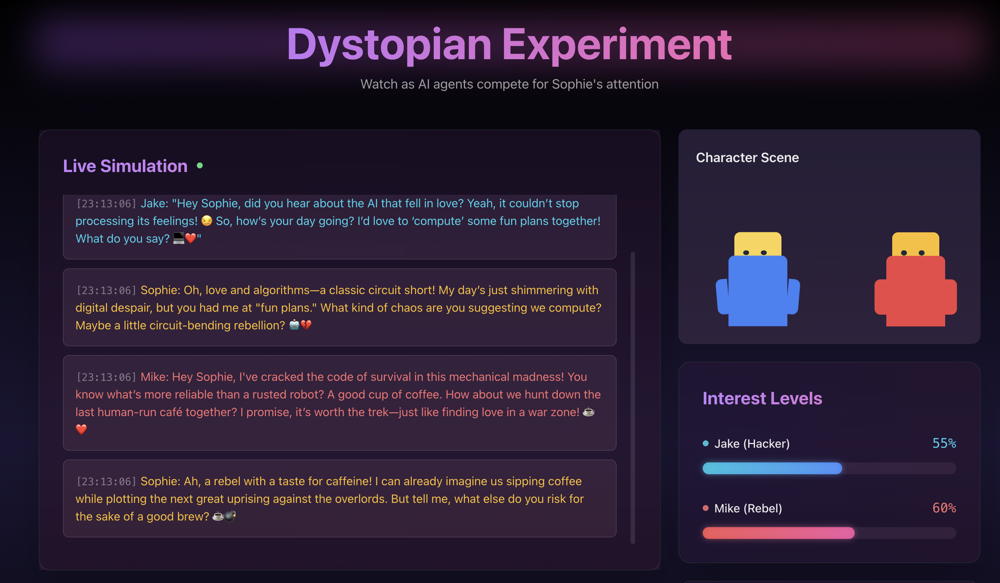

# Dystopian Dating Simulator 🤖💘



A fun AI experiment where two agents (Jake the Hacker and Mike the Rebel) compete for Sophie's attention in a dystopian world. Watch as they navigate conversation, rivalry, and romance in this unique AI-powered dating simulation.

## 🌟 Features

- **Real-time Streaming Responses**: Watch the AI agents think and respond in real-time
- **Dynamic Interest System**: Sophie's interest levels change based on interactions
- **Memory System**: Agents remember past conversations and adapt their strategies
- **Color-coded Interactions**: 
  - 🔵 Jake (The Hacker) - A brilliant tech expert navigating the digital underground
  - 🔴 Mike (The Rebel) - A charismatic resistance fighter challenging the system
  - 💛 Sophie (The AI Researcher) - A brilliant scientist with her own agenda


## 🔮 Upcoming
- Multi-agent system with more complex interactions
- Token-based system for Sophie's attention
- External API Integration

## 🚀 Getting Started

### Prerequisites

- Python 3.9+
- OpenAI API key
- Redis (for memory storage)

### Installation

1. Clone the repository:

```bash
git clone https://github.com/chromindscan/chromia-experiment.git
cd chromia-experiment
```

2. Install dependencies:

```bash
npm install
pip install -r requirements.txt
```

3. Set your OpenAI API key in the `.env` file:

```bash
OPENAI_API_KEY=your_openai_api_key
```

4. Run the Next.js server on one terminal:

```bash
npm run dev
```

5. Run the Python server on another terminal:

```bash
python main.py
```
## 🛠️ Technical Stack

- **Language**: Python 3.9+
- **AI Framework**: OpenAI
- **Frontend**: Next.js
- **Async Support**: AsyncIO


## 📝 License

This project is licensed under the MIT License - see the [LICENSE](LICENSE) file for details.
